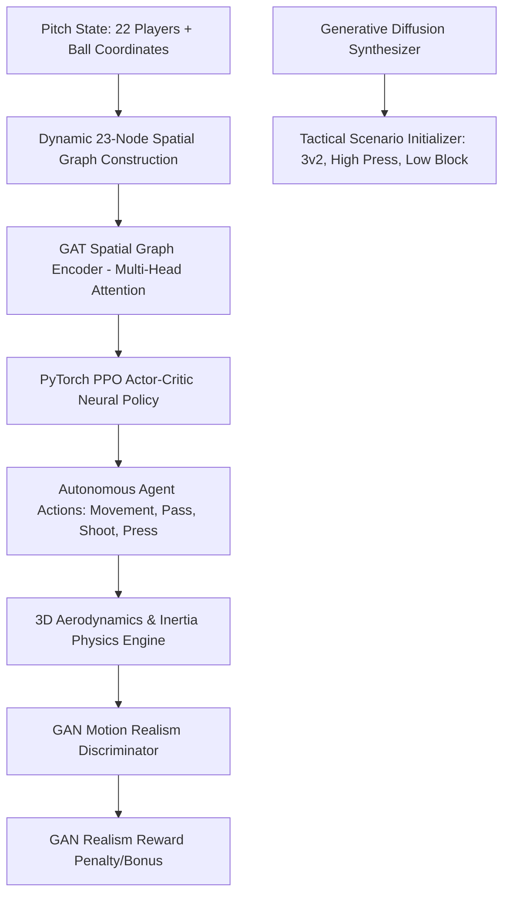

# ⚽ RL Train Football: Multi-Agent Deep Reinforcement Learning Engine

<div align="center">


-EE4C2C?style=for-the-badge&logo=pytorch&logoColor=white)


</div>

> *"Commercial football video games rely on rigid, scripted loops that fail in dynamic match scenarios. **RL Train Football** breaks the paradigm using Graph Attention Networks (GAT), PPO Actor-Critic policies, and GAN Trajectory Realism Discriminators."*

---

## ⚡ Why Commercial Games Fail vs. RL Train Football

| Feature | EA Sports FC / FIFA | Football Manager | **RL Train Football** |
| :--- | :--- | :--- | :--- |
| **Teammate Tactical AI** | Rigid IF-THEN scripts & predetermined runs | Text-based statistical dice rolls | **Multi-Head Graph Attention (GAT)**: Dynamic spatial passing channel computation |
| **Movement Mechanics** | Unrealistic "skating on ice" direction flips | 2D circle translation | **Physical Inertia Engine**: Linear acceleration ($a = 800\,\text{px/s}^2$) & turning momentum |
| **Anti-Jitter Realism** | Exploitable AI loops & robotic movement | No physical trajectory evaluation | **GAN Realism Discriminator**: Trajectory evaluation penalizing unnatural RL jitter |
| **Ball Physics** | Simple 2D ground trajectories | Simplified 2D math | **3D Aerodynamics**: Magnus spin curving, vertical elevation ($z$-axis gravity), bounce damping |
| **Tactical Autonomy** | Requires manual player switching | Non-interactive simulation | **100% Autonomous MARL**: 22 PyTorch neural agents competing across 5 formations |

---

## 🏛️ Deep AI System Architecture



---

## 🔬 Mathematical Formulation

### 1. Multi-Head Graph Attention (GAT) Spatial Passing Encoder
Instead of flattening player coordinates into a primitive vector, the engine models the pitch as a dynamic **23-node spatial graph** $\mathcal{G} = (\mathcal{V}, \mathcal{E})$. Passing channel openness and defender marking pressure are derived via Multi-Head Graph Attention:

$$\alpha_{ij}^{(h)} = \frac{\exp\left(\text{LeakyReLU}\left(\mathbf{a}_h^T [\mathbf{W}_h h_i \parallel \mathbf{W}_h h_j]\right)\right)}{\sum_{k \in \mathcal{N}_i} \exp\left(\text{LeakyReLU}\left(\mathbf{a}_h^T [\mathbf{W}_h h_i \parallel \mathbf{W}_h h_k]\right)\right)}$$

where $\mathbf{W}_h$ is the feature transformation weight matrix for head $h$, $h_i \in \mathbb{R}^8$ represents spatial node features $(x, y, v_x, v_y, \text{team}, \text{role}, \text{stamina}, z)$, and $\alpha_{ij}^{(h)}$ measures spatial passing lane quality.

### 2. Proximal Policy Optimization (PPO) Clipped Objective
Agents optimize policy parameters $\theta$ using PPO clipped surrogate loss with Generalized Advantage Estimation (GAE):

$$L^{\text{CLIP}}(\theta) = \hat{\mathbb{E}}_t \left[ \min \left( r_t(\theta)\hat{A}_t^{\text{GAE}}, \, \text{clip}(r_t(\theta), 1-\epsilon, 1+\epsilon)\hat{A}_t^{\text{GAE}} \right) \right]$$

$$\hat{A}_t^{\text{GAE}} = \sum_{l=0}^{\infty} (\gamma \lambda)^l \delta_{t+l}^V, \quad \text{where } \delta_t^V = r_t + \gamma V(s_{t+1}) - V(s_t)$$

### 3. GAN Trajectory Realism Discriminator
A 1D Convolutional GAN Discriminator $D_\psi$ evaluates player trajectory sequences $T = [\mathbf{x}_t, \mathbf{v}_t, \mathbf{a}_t]_{t=1}^{K}$ over time windows to penalize robotic jittering and reward fluid human momentum:

$$\mathcal{L}_{\text{GAN}}(D_\psi) = \mathbb{E}_{\mathbf{x} \sim p_{\text{real}}} [\log D_\psi(\mathbf{x})] + \mathbb{E}_{\mathbf{z} \sim p_{\mathbf{z}}} [\log (1 - D_\psi(G_\theta(\mathbf{z})))]$$

$$R_{\text{total}}(s_t, a_t) = R_{\text{env}}(s_t, a_t) + \lambda \cdot D_\psi(T_t)$$

### 4. 3D Ball Aerodynamics & Magnus Effect
Ball trajectory integration incorporates elevation ($z$-axis), gravity ($g = 600\,\text{px/s}^2$), vertical ground bounce damping ($0.65$), and Magnus spin curving:

$$\mathbf{F}_{\text{Magnus}} = \frac{1}{2} C_M \rho A d \cdot (\boldsymbol{\omega} \times \mathbf{v})$$

$$\mathbf{p}_{t+\Delta t}^{(3D)} = \mathbf{p}_t^{(3D)} + \mathbf{v}_t^{(3D)} \Delta t + \frac{1}{2} \mathbf{a}_t^{(3D)} (\Delta t)^2$$

---

## 📂 Subsystem & Module Directory Map

```text
AI_gaming/
├── ai/
│   ├── ai_controller.py      # Multi-Agent PyTorch Neural Policy executor
│   └── goalkeeper.py         # Goalkeeper linear intercept projection FSM
├── analytics/
│   ├── spatial_graph.py      # Voronoi pitch dominance & VAR offside engine
│   └── report.py             # Post-match NLP tactical summary generator
├── attributes/
│   └── profile.py            # RPG player ratings (pace, stamina, composure, vision)
├── debug/
│   └── overlay.py            # F3 tactical overlay (vectors, stamina, roles)
├── engine/
│   ├── game.py               # Main autonomous game loop orchestrator
│   ├── match.py              # Match state, goal net triggers, 180s match clock
│   └── settings.py           # Pitch dimensions, physical constants, formation vectors
├── entities/
│   ├── ball.py               # 3D Ball entity (Magnus spin, altitude, net bounds)
│   ├── entity.py             # 3D Vector coordinate base entity class
│   ├── players.py            # Player entity (linear acceleration, weighted first touches)
│   └── team.py               # Squad management & target goal setup
├── physics/
│   └── collision.py          # 3D player-ball & player-player pitch bound clamping
├── rendering/
│   ├── camera.py             # Dynamic lerp tracking camera with action zoom
│   ├── net_physics.py        # Goal net spring-mass physical grid simulation
│   ├── particles.py          # Grass turf particles, ball trails, goal sparks
│   └── renderer.py           # 2.5D Renderer (directional shadows, 3D ball height, HUD)
├── rl_env/
│   ├── diffusion_gen.py      # Score-based Diffusion tactical scenario synthesizer
│   ├── football_env.py       # Gymnasium-compatible RL environment interface
│   ├── gan_discriminator.py  # Trajectory realism GAN discriminator
│   ├── gnn_encoder.py        # Multi-Head Graph Attention Network (GAT)
│   ├── nn_brain.py           # CUDA GPU-accelerated FootballActorCritic model
│   └── trainer.py            # PyTorch PPO trainer with GAE advantage estimation
├── ui/
│   ├── dashboard.py          # Real-time live PPO telemetry dashboard overlay
│   └── menu.py               # Modern glassmorphism UI menu system
├── main.py                   # Application entry point
└── README.md                 # System documentation & research specification
```

---

## 🚀 Quickstart & Execution

### Prerequisites
Install Python 3.11+ and dependencies:
```bash
pip install pygame torch numpy scipy
```

### Launch the Engine
```bash
python main.py
```

### Interactive Menu Modes
1. **1. RL TACTICAL CLASH**: Watch 100% autonomous GNN-PPO neural models compete in full matches (`4-3-3`, `4-4-2`, `3-5-2`, `4-2-3-1`, `5-3-2`).
2. **2. LIVE PPO SELF-PLAY TRAINING**: Launch interactive training with live visual telemetry graphs.
3. **3. SPATIAL VORONOI ANALYTICS**: Analyze spatial pitch dominance zones and dynamic passing networks.
4. **4. FORMATION & TACTICAL MANAGER**: Customize team formations and PyTorch model checkpoints.

---

## 🎮 Keyboard Shortcuts
- **F3**: Toggle Visual Tactical Overlay (intended movement vectors, stamina bars, role tags)
- **ESC**: Return to Main Menu

---

<div align="center">

*“Football is played with the head. Your feet are just the tools.”* — **RL Train Football Engine**

</div>
