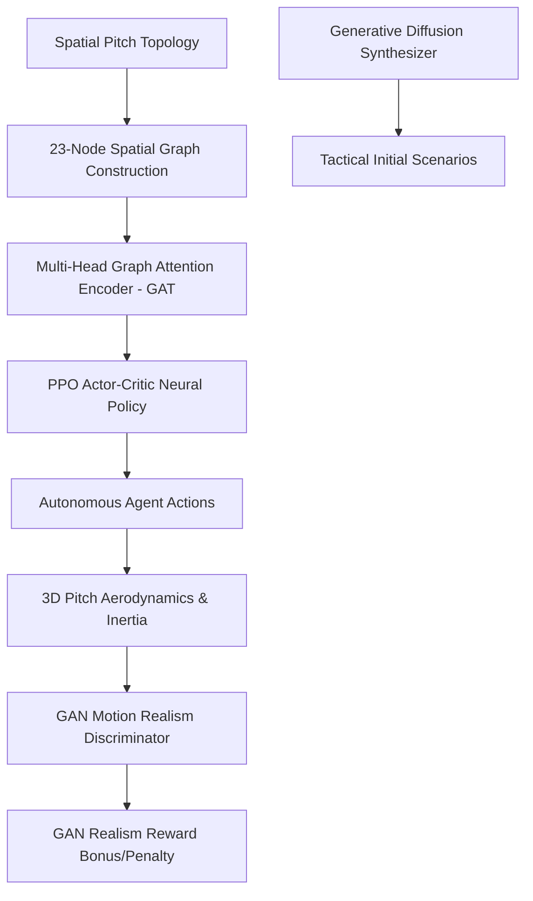

# ⚽ RL Train Football: Multi-Agent Deep Reinforcement Learning Engine

[](https://www.python.org/)
[](https://pytorch.org/)
[](https://www.pygame.org/)
[](#-deep-ai-architecture)
[](#-license)

**RL Train Football** is a state-of-the-art 100% autonomous multi-agent Deep Reinforcement Learning (MARL) football engine. Built in Python and PyTorch, it moves beyond simple arcade mechanics to deliver an advanced tactical simulation where 22 autonomous agents compete using **Graph Attention Network (GAT)** spatial encoders, **PPO Actor-Critic Neural Policies**, **GAN Motion Realism Discriminators**, and **Generative Diffusion Scenario Synthesizers**.

---

## 🏛️ Deep AI Architecture & Mathematical Formulation



### 1. Graph Attention Network (GAT) Spatial Passing Encoder
Instead of flattening player coordinates into a unstructured vector, the environment constructs a dynamic **23-node spatial graph** (22 players + ball). Passing channels and defender marking pressure are modeled via Multi-Head Graph Attention:

$$\alpha_{ij} = \frac{\exp\left(\text{LeakyReLU}\left(\mathbf{a}^T [\mathbf{W}h_i \parallel \mathbf{W}h_j]\right)\right)}{\sum_{k \in \mathcal{N}_i} \exp\left(\text{LeakyReLU}\left(\mathbf{a}^T [\mathbf{W}h_i \parallel \mathbf{W}h_k]\right)\right)}$$

where $\mathbf{W}$ is the shared node feature transformation weight matrix, $h_i$ represents spatial node features $(x, y, v_x, v_y, \text{team}, \text{role}, \text{stamina})$, and $\alpha_{ij}$ represents dynamic passing channel openness.

### 2. Proximal Policy Optimization (PPO) Clipped Surrogate Objective
Agents optimize their tactical policy parameters $\theta$ using the PPO clipped objective with Generalized Advantage Estimation (GAE):

$$L^{\text{CLIP}}(\theta) = \hat{\mathbb{E}}_t \left[ \min \left( r_t(\theta)\hat{A}_t, \, \text{clip}(r_t(\theta), 1-\epsilon, 1+\epsilon)\hat{A}_t \right) \right]$$

where $r_t(\theta) = \frac{\pi_\theta(a_t|s_t)}{\pi_{\theta_{\text{old}}}(a_t|s_t)}$ is the probability ratio and $\hat{A}_t$ is the GAE advantage estimator.

### 3. GAN Motion Realism Discriminator (Anti-Jitter Reward Shaping)
A convolutional GAN Discriminator $D_\psi$ evaluates player trajectory sequences $T = [\mathbf{x}_t, \mathbf{v}_t, \mathbf{a}_t]_{t=1}^{K}$ over time windows to penalize robotic jittering and reward realistic human inertia:

$$R_{\text{total}}(s_t, a_t) = R_{\text{env}}(s_t, a_t) + \lambda \cdot D_\psi(T_t)$$

### 4. 3D Ball Aerodynamics & Magnus Effect
Ball trajectory integration includes vertical elevation ($z$-axis), gravity ($g = 600\,\text{px/s}^2$), ground bounce damping ($0.65$), and Magnus lateral spin curving:

$$\mathbf{F}_{\text{Magnus}} = S \cdot (\boldsymbol{\omega} \times \mathbf{v})$$

---

## ✨ Core System Subsystems

| Subsystem | Description | Location |
| :--- | :--- | :--- |
| **GNN Spatial Encoder** | Multi-Head Graph Attention Network modeling passing channels & marking pressure | [gnn_encoder.py](file:///c:/Users/DELL/Desktop/gaming/AI_gaming/rl_env/gnn_encoder.py) |
| **GAN Discriminator** | Trajectory realism discriminator evaluating acceleration curves & inertia | [gan_discriminator.py](file:///c:/Users/DELL/Desktop/gaming/AI_gaming/rl_env/gan_discriminator.py) |
| **Diffusion Synthesizer** | Score-based Diffusion model generating tactical scenario initial states | [diffusion_gen.py](file:///c:/Users/DELL/Desktop/gaming/AI_gaming/rl_env/diffusion_gen.py) |
| **PPO Neural Brain** | CUDA GPU-accelerated Actor-Critic neural network for real-time inference | [nn_brain.py](file:///c:/Users/DELL/Desktop/gaming/AI_gaming/rl_env/nn_brain.py) |
| **PPO Self-Play Trainer** | Multi-threaded PPO training pipeline with model checkpointing (`.pt`) | [trainer.py](file:///c:/Users/DELL/Desktop/gaming/AI_gaming/rl_env/trainer.py) |
| **2.5D Renderer** | Dynamic camera lerp, directional player shadows, 3D elevation, net ripples | [renderer.py](file:///c:/Users/DELL/Desktop/gaming/AI_gaming/rendering/renderer.py) |
| **Live Telemetry Dashboard**| Real-time visual graph overlay showing reward curves, loss, & GAN scores | [dashboard.py](file:///c:/Users/DELL/Desktop/gaming/AI_gaming/ui/dashboard.py) |
| **Spatial Graph Analytics** | Voronoi pitch dominance calculation & VAR offside line projection | [spatial_graph.py](file:///c:/Users/DELL/Desktop/gaming/AI_gaming/analytics/spatial_graph.py) |

---

## 🚀 Installation & Execution

### Prerequisites
Make sure you have Python 3.11+ installed with the required scientific packages:
```bash
pip install pygame torch numpy scipy
```

### Run the Simulation Platform
```bash
python main.py
```

### Interactive Modes
- **1. RL TACTICAL CLASH**: Watch 100% autonomous GNN-PPO models compete in tactical formations (`4-3-3`, `4-4-2`, `3-5-2`, `4-2-3-1`, `5-3-2`).
- **2. LIVE PPO SELF-PLAY TRAINING**: Launch interactive self-play training with real-time telemetry graphs.
- **3. SPATIAL VORONOI ANALYTICS**: Analyze spatial pitch dominance zones and dynamic passing networks.
- **4. FORMATION & TACTICAL MANAGER**: Customize team formations and PyTorch model checkpoints.

---

## 🎮 Keyboard Shortcuts
- **F3**: Toggle Visual Tactical Debug Overlay (velocity vectors, stamina ratings, role tags)
- **ESC**: Return to Main Menu

---

*“Football is played with the head. Your feet are just the tools.”* — **RL Train Football Engine**
