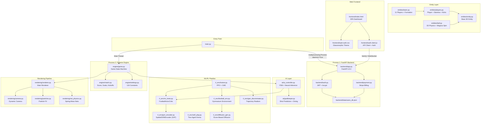
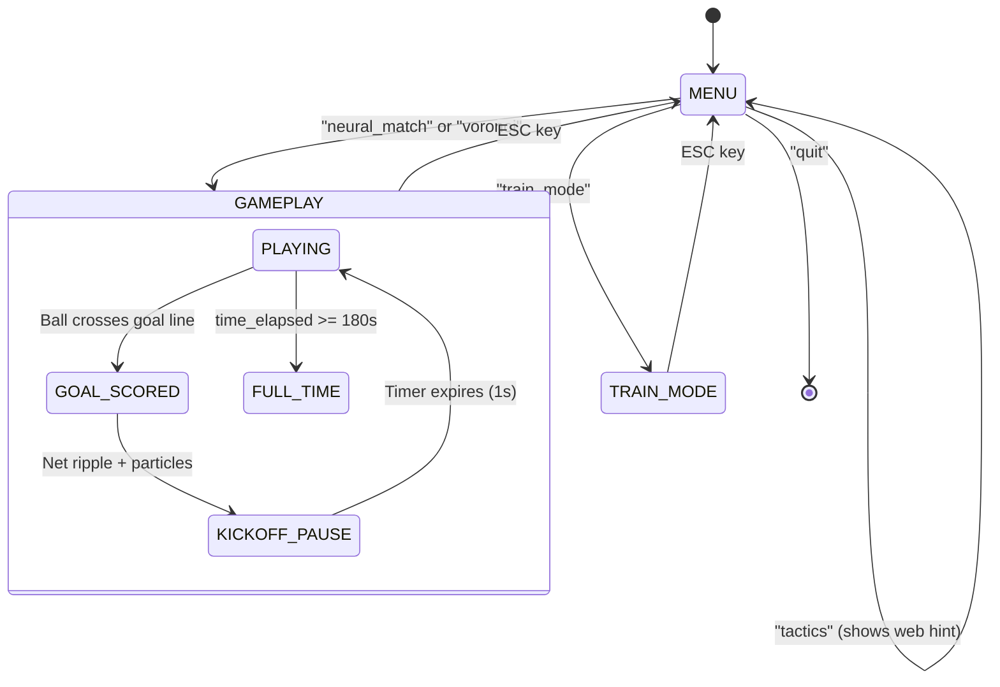
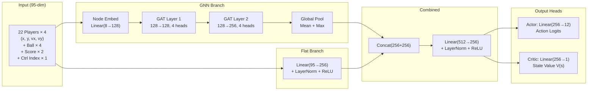
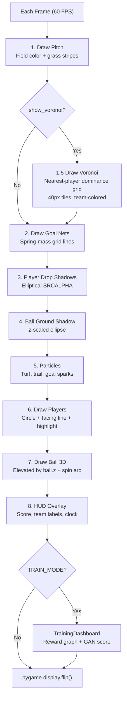
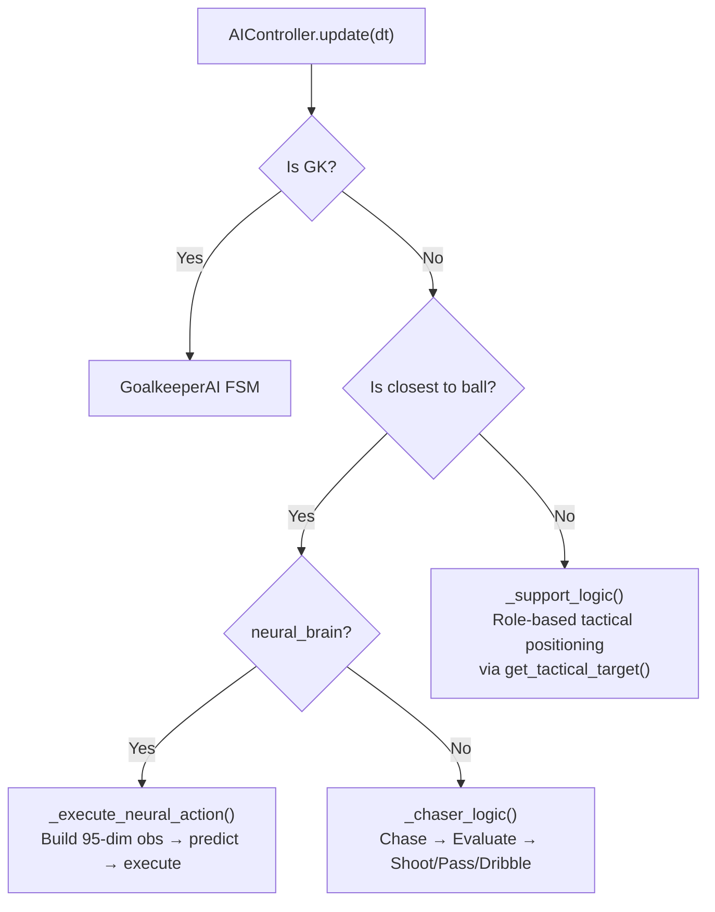
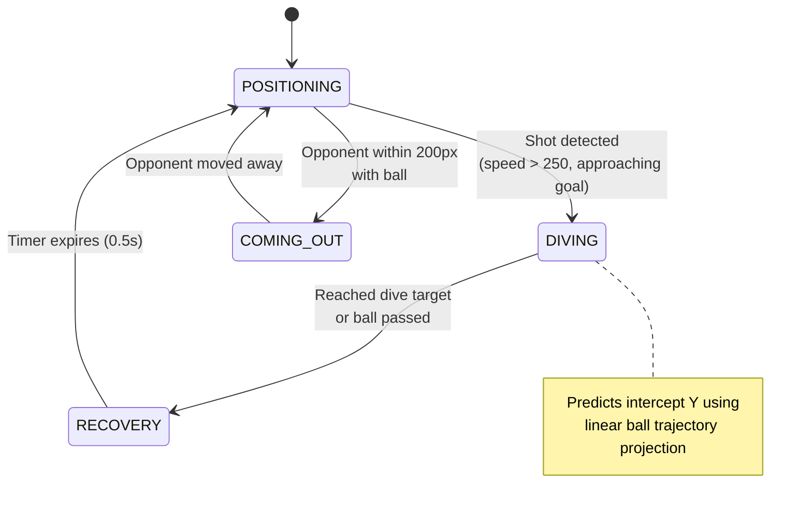
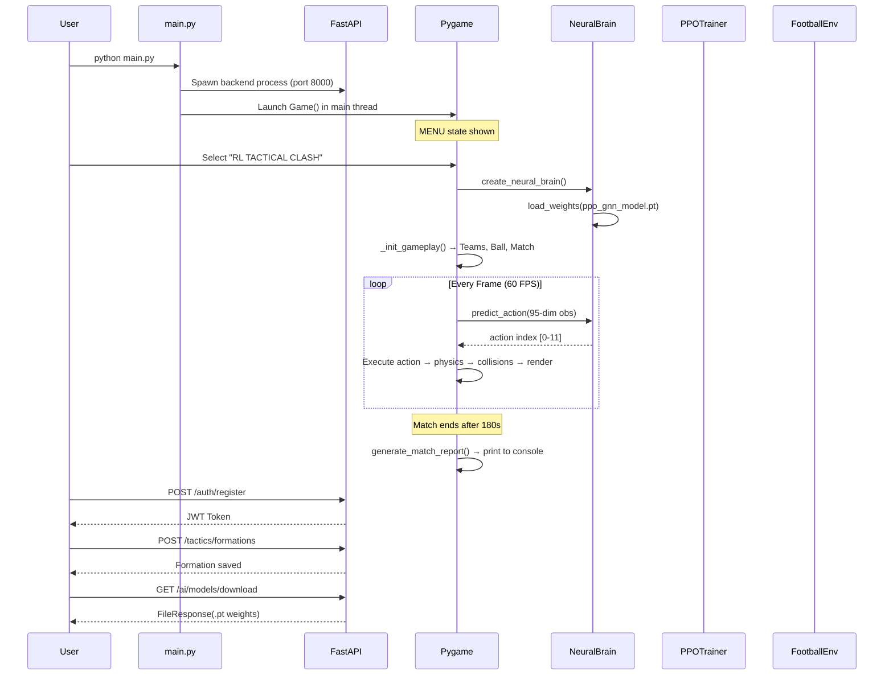

# 🏟️ RL Train Football — Complete Project Analysis

> Exhaustive analysis of all **38 source files** across **14 packages**, covering the full frontend, backend, ML/RL pipeline, engine, rendering, and project workflow.

---

## 📁 Project Structure Overview

```
AI_gaming/
├── main.py                     # Dual-process entry point
├── README.md                   # Project documentation
│
├── engine/                     # Core game loop & config
│   ├── game.py                 # Main Game class (state machine)
│   ├── match.py                # Match rules, goals, kickoffs
│   └── settings.py             # All constants & formation coords
│
├── entities/                   # Game objects (ECS-style)
│   ├── entity.py               # Base 3D Entity (position, velocity, z)
│   ├── players.py              # Player: input, stamina, kick, shoot
│   ├── ball.py                 # Ball: 3D physics, spin, gravity, bounce
│   └── team.py                 # Team: 11 players + formation loading
│
├── ai/                         # AI decision-making
│   ├── ai_controller.py        # Main AI: FSM + Neural Brain inference
│   └── goalkeeper.py           # Dedicated GK: shot prediction & diving
│
├── rl_env/                     # Reinforcement Learning pipeline
│   ├── nn_brain.py             # FootballActorCritic (GNN+MLP) + fallback
│   ├── gnn_encoder.py          # SpatialGNNEncoder (GAT layers)
│   ├── football_env.py         # Gymnasium-like RL environment
│   ├── trainer.py              # PPO training loop (GAE + clipping)
│   ├── self_play.py            # Two-agent self-play environment
│   ├── gan_discriminator.py    # Trajectory realism discriminator
│   ├── diffusion_gen.py        # Score-based diffusion scenario gen
│   └── checkpoints/            # Saved .pt model weights
│
├── tactics/                    # Tactical systems
│   ├── formations.py           # Formation coords (4-3-3, 4-4-2) + dynamic shifts
│   └── manager.py              # DynamicManagerAI (score-time adaptation)
│
├── physics/
│   └── collision.py            # Player-ball, player-player, boundary clamping
│
├── rendering/                  # Visual pipeline
│   ├── renderer.py             # Main renderer: pitch, players, ball, HUD, Voronoi
│   ├── camera.py               # Dynamic camera: lerp tracking, contextual zoom
│   ├── particles.py            # Particle system: turf, trail, goal sparks
│   └── net_physics.py          # Spring-mass goal net ripple simulation
│
├── attributes/
│   └── profile.py              # PlayerProfile: pace, stamina, shooting, vision
│
├── stats/
│   └── tracker.py              # MatchStats: possession, passes, shots, tackles
│
├── analytics/
│   ├── spatial_graph.py        # Offside line calc, team compactness
│   └── report.py               # Post-match NLP analytical report
│
├── debug/
│   └── overlay.py              # F3 debug overlay (velocity vectors, stamina)
│
├── ui/                         # Pygame UI screens
│   ├── menu.py                 # MainMenu (5 modes)
│   └── dashboard.py            # TrainingDashboard (live reward graph)
│
├── backend/                    # FastAPI SaaS backend
│   ├── app.py                  # REST + WebSocket API (307 lines)
│   ├── auth.py                 # JWT auth, hashing, quotas, thread-safe DB
│   ├── payment.py              # Stripe checkout, portal, webhooks
│   ├── requirements.txt        # Python dependencies
│   └── data/
│       └── users_db.json       # Flat-file user database
│
└── frontend/                   # Web dashboard
    ├── index.html              # SPA: pitch editor, telemetry, modals (928 lines)
    ├── style-auth.css           # Glassmorphic dark theme (13KB)
    └── auth-client.js           # Auth flows, API calls, toast system (17KB)
```

---

## 🔀 System Architecture



---

## 🎮 Game State Machine



---

## 🧠 ML/RL Pipeline Deep Dive

### Neural Network Architecture



### Action Space (12 discrete actions)

| Index | Action | Description |
|-------|--------|-------------|
| 0 | Idle | No movement |
| 1 | Up | Move (0, -1) |
| 2 | Down | Move (0, +1) |
| 3 | Left | Move (-1, 0) |
| 4 | Right | Move (+1, 0) |
| 5 | Up-Left | Move (-1, -1) |
| 6 | Up-Right | Move (+1, -1) |
| 7 | Down-Left | Move (-1, +1) |
| 8 | Down-Right | Move (+1, +1) |
| 9 | Pass | Context-aware pass to best teammate |
| 10 | Shoot | Shoot toward opponent goal |
| 11 | Switch | Switch controlled player |

### Reward Shaping

| Signal | Value | Source |
|--------|-------|--------|
| Goal scored | +1.0 | `settings.RL_REWARD_GOAL` |
| Goal conceded | -1.0 | `settings.RL_REWARD_CONCEDE` |
| Possession tick | +0.001 | `settings.RL_REWARD_POSSESSION` |
| Ball progress toward goal | +0.0005 | `settings.RL_REWARD_BALL_PROGRESS` |

### PPO Training Loop ([trainer.py](file:///c:/Users/User/Desktop/best_resume_maker/AI_gaming/rl_env/trainer.py))

```
1. Collect trajectory: obs, actions, log_probs, rewards, values
2. Compute GAE advantages (λ=0.95, γ=0.99)
3. Compute returns = advantages + values
4. For K epochs (K=4):
   a. Forward pass → new log_probs, new values
   b. Ratio = exp(new_log_prob - old_log_prob)
   c. Actor loss = -min(ratio*A, clip(ratio, 1±ε)*A) - β*entropy
   d. Critic loss = MSE(new_value, returns)
   e. Total loss = actor_loss + 0.5*critic_loss
   f. Backprop + Adam step
5. Score trajectory with GAN discriminator → realism metric
6. Save checkpoint to rl_env/checkpoints/ppo_gnn_model.pt
```

### Diffusion Scenario Generator ([diffusion_gen.py](file:///c:/Users/User/Desktop/best_resume_maker/AI_gaming/rl_env/diffusion_gen.py))

- Score-based diffusion model (46-dim state = 22 players × 2 coords + ball × 2)
- Time-conditioned MLP: `state(46) + time_embed(32) → 128 → 128 → 46`
- 20-step reverse sampling with noise schedule
- Integrated into `football_env.reset()` with 20% activation probability
- Purpose: Generates diverse tactical starting positions (counter-attacks, low blocks)

### GAN Trajectory Discriminator ([gan_discriminator.py](file:///c:/Users/User/Desktop/best_resume_maker/AI_gaming/rl_env/gan_discriminator.py))

- Scores trajectory realism on [0, 1]
- Used as auxiliary metric during training (not loss signal)

---

## 🌐 Backend API Routes

### Authentication Endpoints

| Method | Route | Auth | Description |
|--------|-------|------|-------------|
| `GET` | `/` | ❌ | Health check + service info |
| `POST` | `/auth/register` | ❌ | Create new user account |
| `POST` | `/auth/login` | ❌ | JWT token generation |
| `GET` | `/auth/me` | ✅ | Get current user profile |
| `PATCH` | `/auth/profile/update` | ✅ | Update full_name / email |
| `GET` | `/auth/activity` | ✅ | Last 20 activity log entries |

### Tactical Formation Endpoints

| Method | Route | Auth | Description |
|--------|-------|------|-------------|
| `POST` | `/tactics/formations` | ✅ | Save custom formation (quota-gated) |
| `GET` | `/tactics/formations` | ✅ | List all saved formations |

### AI Model Endpoints

| Method | Route | Auth | Description |
|--------|-------|------|-------------|
| `GET` | `/ai/models/download` | ✅ Pro+ | Download `.pt` weights via FileResponse |

### Billing Endpoints (Stripe)

| Method | Route | Auth | Description |
|--------|-------|------|-------------|
| `POST` | `/payment/checkout` | ✅ | Create Stripe checkout session |
| `POST` | `/payment/portal` | ✅ | Create Stripe billing portal session |
| `POST` | `/payment/webhook` | ❌ | Stripe webhook event handler |

### WebSocket

| Protocol | Route | Description |
|----------|-------|-------------|
| `WS` | `/ws/telemetry` | Live training telemetry broadcast |

### SaaS Tier System

| Plan | Price | Max Formations | Model Download | Stripe Price ID |
|------|-------|---------------|----------------|-----------------|
| Free | $0 | 3 | ❌ | — |
| Pro Trainer | $9.99/mo | 25 | ✅ | `price_mock_pro_trainer_99` |
| Developer | $49.99/mo | Unlimited | ✅ | `price_mock_developer_499` |

---

## 🎨 Rendering Pipeline



### Camera System ([camera.py](file:///c:/Users/User/Desktop/best_resume_maker/AI_gaming/rendering/camera.py))

| Feature | Implementation |
|---------|---------------|
| Tracking | Follows ball with lead-ahead (velocity × 0.25) |
| Interpolation | Smooth lerp at 4.0 speed factor |
| Contextual Zoom | 1.25× near goals, 1.35× on goal celebrations |
| Coordinate Transform | `world_to_screen()` and `scale()` methods |
| Boundary Clamping | Prevents camera from showing off-pitch areas |

---

## ⚽ Physics System

### Ball Physics ([ball.py](file:///c:/Users/User/Desktop/best_resume_maker/AI_gaming/entities/ball.py))

| Feature | Value | Description |
|---------|-------|-------------|
| Gravity | 600 px/s² | Downward z-acceleration |
| Ground Friction | 300 px/s | Linear deceleration on ground |
| Bounce Damping | 0.65 | Vertical velocity retention on bounce |
| Wall Bounce | 0.70 | Horizontal velocity retention off walls |
| Air Drag | 0.15 | Speed decay multiplier in air |
| Magnus Spin | -1.0 to 1.0 | Lateral curve force perpendicular to velocity |
| Stop Threshold | 5 px/s | Below this, velocity zeroes out |

### Player Physics ([players.py](file:///c:/Users/User/Desktop/best_resume_maker/AI_gaming/entities/players.py))

| Feature | Value | Description |
|---------|-------|-------------|
| Base Speed | 200 px/s | Normal movement |
| Sprint Speed | 340 px/s | When holding Shift |
| Acceleration | 800 px/s² | Smooth velocity interpolation |
| Stamina Drain | 5.0/s | While sprinting (>1.1× base speed) |
| Stamina Regen | 2.0/s | While resting (<0.5× base speed) |
| Fatigue Penalty | 70-100% | Speed multiplier based on stamina |
| Kick Range | 30 px | Max distance to kick ball |
| Pass Error | (100 - passing) × 0.4° | Angular deviation on passes |
| Shot Error | (100 - shooting) × 0.3° | Angular deviation on shots |

---

## 🤖 AI Decision Architecture

### Outfield Players ([ai_controller.py](file:///c:/Users/User/Desktop/best_resume_maker/AI_gaming/ai/ai_controller.py))



### Goalkeeper FSM ([goalkeeper.py](file:///c:/Users/User/Desktop/best_resume_maker/AI_gaming/ai/goalkeeper.py))



---

## 🌐 Frontend Architecture

### Web Dashboard ([index.html](file:///c:/Users/User/Desktop/best_resume_maker/AI_gaming/frontend/index.html) — 928 lines)

| Component | Description |
|-----------|-------------|
| **Tactical Pitch Editor** | Canvas-based drag-and-drop formation editor with 11 player nodes |
| **GNN Pass Lanes** | Auto-drawn edges between 2 nearest players (simulated attention weights) |
| **Formation Presets** | 4-3-3, 4-4-2, 3-5-2, 4-2-3-1, 5-3-2 |
| **RL Telemetry Chart** | Chart.js line graph: reward curve + GAT loss (15-epoch window) |
| **Telemetry Stats** | Avg Reward, GAT Loss, GAN Score real-time counters |
| **Auth Modal** | Login + Register forms with JWT token management |
| **Profile Modal** | 3-tab: Account settings, Formation Quota bar, Activity Log |
| **Subscription Modal** | 3-tier plan cards with Stripe checkout integration |
| **Download Gate** | Lock overlay on PPO Model Explorer (unlocked for Pro+) |
| **Toast System** | Animated notification toasts (success, error, warning, info) |
| **Sound FX** | Web Audio API beeps for auth success |

### API Client ([auth-client.js](file:///c:/Users/User/Desktop/best_resume_maker/AI_gaming/frontend/auth-client.js) — 17KB)

- JWT token storage in `localStorage`
- Automatic `Authorization: Bearer` headers
- `auth-change` CustomEvent dispatch on login/logout
- Dynamic UI state management (avatar, plan badge, lock overlays)
- Stripe Checkout redirect handling

---

## 📊 Complete File Inventory

| # | File | Lines | Bytes | Purpose |
|---|------|-------|-------|---------|
| 1 | [main.py](file:///c:/Users/User/Desktop/best_resume_maker/AI_gaming/main.py) | 24 | 653 | Dual-process entry point |
| 2 | [engine/game.py](file:///c:/Users/User/Desktop/best_resume_maker/AI_gaming/engine/game.py) | 193 | 7,516 | Game state machine + orchestration |
| 3 | [engine/match.py](file:///c:/Users/User/Desktop/best_resume_maker/AI_gaming/engine/match.py) | 79 | 2,890 | Match rules, goal detection, kickoffs |
| 4 | [engine/settings.py](file:///c:/Users/User/Desktop/best_resume_maker/AI_gaming/engine/settings.py) | 116 | 3,774 | All game constants (116 settings) |
| 5 | [entities/entity.py](file:///c:/Users/User/Desktop/best_resume_maker/AI_gaming/entities/entity.py) | 42 | 1,227 | Base 3D entity with Vector3 physics |
| 6 | [entities/players.py](file:///c:/Users/User/Desktop/best_resume_maker/AI_gaming/entities/players.py) | 134 | 5,722 | Player: stamina, input, kicking |
| 7 | [entities/ball.py](file:///c:/Users/User/Desktop/best_resume_maker/AI_gaming/entities/ball.py) | 135 | 5,708 | Ball: gravity, spin, wall bounces |
| 8 | [entities/team.py](file:///c:/Users/User/Desktop/best_resume_maker/AI_gaming/entities/team.py) | 51 | 1,826 | Team factory + closest-to-ball |
| 9 | [ai/ai_controller.py](file:///c:/Users/User/Desktop/best_resume_maker/AI_gaming/ai/ai_controller.py) | 207 | 7,929 | AI FSM + PyTorch neural inference |
| 10 | [ai/goalkeeper.py](file:///c:/Users/User/Desktop/best_resume_maker/AI_gaming/ai/goalkeeper.py) | 185 | 7,203 | GK: shot prediction, diving, 1v1 |
| 11 | [rl_env/nn_brain.py](file:///c:/Users/User/Desktop/best_resume_maker/AI_gaming/rl_env/nn_brain.py) | 139 | 5,103 | Actor-Critic network + NumPy fallback |
| 12 | [rl_env/gnn_encoder.py](file:///c:/Users/User/Desktop/best_resume_maker/AI_gaming/rl_env/gnn_encoder.py) | 90 | 3,768 | GAT layers + spatial adjacency |
| 13 | [rl_env/football_env.py](file:///c:/Users/User/Desktop/best_resume_maker/AI_gaming/rl_env/football_env.py) | ~250 | 10,856 | Gymnasium-style RL environment |
| 14 | [rl_env/trainer.py](file:///c:/Users/User/Desktop/best_resume_maker/AI_gaming/rl_env/trainer.py) | ~140 | 6,216 | PPO training with GAE |
| 15 | [rl_env/self_play.py](file:///c:/Users/User/Desktop/best_resume_maker/AI_gaming/rl_env/self_play.py) | 326 | 11,683 | Two-agent environment + SB3 example |
| 16 | [rl_env/gan_discriminator.py](file:///c:/Users/User/Desktop/best_resume_maker/AI_gaming/rl_env/gan_discriminator.py) | ~60 | 2,170 | Trajectory realism scoring |
| 17 | [rl_env/diffusion_gen.py](file:///c:/Users/User/Desktop/best_resume_maker/AI_gaming/rl_env/diffusion_gen.py) | 56 | 1,890 | Score-based scenario diffusion |
| 18 | [tactics/formations.py](file:///c:/Users/User/Desktop/best_resume_maker/AI_gaming/tactics/formations.py) | 61 | 2,159 | Formation coords + dynamic shifts |
| 19 | [tactics/manager.py](file:///c:/Users/User/Desktop/best_resume_maker/AI_gaming/tactics/manager.py) | 45 | 1,598 | Dynamic in-game tactical adaptation |
| 20 | [physics/collision.py](file:///c:/Users/User/Desktop/best_resume_maker/AI_gaming/physics/collision.py) | 61 | 2,466 | All collision resolution |
| 21 | [rendering/renderer.py](file:///c:/Users/User/Desktop/best_resume_maker/AI_gaming/rendering/renderer.py) | 248 | 11,134 | Main renderer + Voronoi overlay |
| 22 | [rendering/camera.py](file:///c:/Users/User/Desktop/best_resume_maker/AI_gaming/rendering/camera.py) | 60 | 2,798 | Dynamic camera with contextual zoom |
| 23 | [rendering/particles.py](file:///c:/Users/User/Desktop/best_resume_maker/AI_gaming/rendering/particles.py) | 76 | 2,926 | Turf, trail, and goal spark particles |
| 24 | [rendering/net_physics.py](file:///c:/Users/User/Desktop/best_resume_maker/AI_gaming/rendering/net_physics.py) | 73 | 2,622 | Spring-mass goal net simulation |
| 25 | [attributes/profile.py](file:///c:/Users/User/Desktop/best_resume_maker/AI_gaming/attributes/profile.py) | 35 | 1,122 | Player attribute system |
| 26 | [stats/tracker.py](file:///c:/Users/User/Desktop/best_resume_maker/AI_gaming/stats/tracker.py) | 42 | 1,384 | Match statistics tracking |
| 27 | [analytics/spatial_graph.py](file:///c:/Users/User/Desktop/best_resume_maker/AI_gaming/analytics/spatial_graph.py) | 48 | 2,209 | Offside line, team compactness |
| 28 | [analytics/report.py](file:///c:/Users/User/Desktop/best_resume_maker/AI_gaming/analytics/report.py) | 46 | 2,130 | Post-match NLP report generation |
| 29 | [debug/overlay.py](file:///c:/Users/User/Desktop/best_resume_maker/AI_gaming/debug/overlay.py) | 34 | 1,252 | F3 debug overlay |
| 30 | [ui/menu.py](file:///c:/Users/User/Desktop/best_resume_maker/AI_gaming/ui/menu.py) | 67 | 3,102 | Pygame main menu |
| 31 | [ui/dashboard.py](file:///c:/Users/User/Desktop/best_resume_maker/AI_gaming/ui/dashboard.py) | 64 | 2,733 | Pygame training dashboard overlay |
| 32 | [backend/app.py](file:///c:/Users/User/Desktop/best_resume_maker/AI_gaming/backend/app.py) | 310 | 10,272 | FastAPI REST + WebSocket server |
| 33 | [backend/auth.py](file:///c:/Users/User/Desktop/best_resume_maker/AI_gaming/backend/auth.py) | ~120 | 4,261 | JWT auth + thread-safe user DB |
| 34 | [backend/payment.py](file:///c:/Users/User/Desktop/best_resume_maker/AI_gaming/backend/payment.py) | 225 | 8,465 | Stripe checkout/portal/webhooks |
| 35 | [frontend/index.html](file:///c:/Users/User/Desktop/best_resume_maker/AI_gaming/frontend/index.html) | 928 | 32,875 | Complete SPA dashboard |
| 36 | [frontend/style-auth.css](file:///c:/Users/User/Desktop/best_resume_maker/AI_gaming/frontend/style-auth.css) | ~400 | 13,330 | Glassmorphic dark theme CSS |
| 37 | [frontend/auth-client.js](file:///c:/Users/User/Desktop/best_resume_maker/AI_gaming/frontend/auth-client.js) | ~500 | 17,042 | Auth client + API integration |
| 38 | [README.md](file:///c:/Users/User/Desktop/best_resume_maker/AI_gaming/README.md) | ~200 | 8,941 | Project documentation |

**Total: ~4,700+ lines of code across 38 files**

---

## 🔄 Complete Data Flow



---

## ✅ Completeness Checklist

| Category | Component | Status |
|----------|-----------|--------|
| **Engine** | Game state machine (MENU → GAMEPLAY → TRAIN_MODE) | ✅ Complete |
| **Engine** | Match rules (goals, kickoffs, full-time) | ✅ Complete |
| **Engine** | Dual-process startup (FastAPI + Pygame) | ✅ Complete |
| **Entities** | 3D Entity base with Vector3 position/velocity | ✅ Complete |
| **Entities** | Player stamina, fatigue, attribute-based kicks | ✅ Complete |
| **Entities** | Ball 3D physics: gravity, spin, bounce, Magnus | ✅ Complete |
| **AI** | Outfield FSM: chase → evaluate → shoot/pass/dribble | ✅ Complete |
| **AI** | Neural inference: 95-dim obs → GNN → action | ✅ Complete |
| **AI** | Goalkeeper: shot prediction, diving, 1v1 rushes | ✅ Complete |
| **AI** | Dynamic manager (tactical adaptation by score/time) | ✅ Complete |
| **RL** | PPO training loop with GAE advantages | ✅ Complete |
| **RL** | GNN encoder (GAT, spatial adjacency) | ✅ Complete |
| **RL** | Actor-Critic network (shared features) | ✅ Complete |
| **RL** | GAN trajectory discriminator | ✅ Complete |
| **RL** | Diffusion scenario generator (integrated) | ✅ Complete |
| **RL** | Self-play two-agent environment | ✅ Complete |
| **RL** | Model weight persistence + loading | ✅ Complete |
| **Rendering** | 2.5D renderer with pitch, shadows, HUD | ✅ Complete |
| **Rendering** | Dynamic camera with contextual zoom | ✅ Complete |
| **Rendering** | Particle system (turf, trail, goal sparks) | ✅ Complete |
| **Rendering** | Spring-mass goal net ripple physics | ✅ Complete |
| **Rendering** | Voronoi spatial dominance overlay | ✅ Complete |
| **Backend** | JWT authentication (register, login, profile) | ✅ Complete |
| **Backend** | Thread-safe JSON database with locking | ✅ Complete |
| **Backend** | Formation CRUD with quota enforcement | ✅ Complete |
| **Backend** | Model download via FileResponse | ✅ Complete |
| **Backend** | Stripe billing (checkout, portal, webhooks) | ✅ Complete |
| **Backend** | WebSocket telemetry broadcast | ✅ Complete |
| **Frontend** | Glassmorphic SPA dashboard | ✅ Complete |
| **Frontend** | Drag-and-drop formation canvas editor | ✅ Complete |
| **Frontend** | Chart.js telemetry graphs | ✅ Complete |
| **Frontend** | Auth modals (login, register, profile) | ✅ Complete |
| **Frontend** | Subscription tier selector + Stripe redirect | ✅ Complete |
| **Frontend** | Pro-gated model download overlay | ✅ Complete |
| **Analytics** | Post-match NLP tactical report | ✅ Complete |
| **Analytics** | Offside line calculation | ✅ Complete |
| **Analytics** | Team compactness metric | ✅ Complete |
| **Debug** | F3 overlay (velocity vectors, stamina labels) | ✅ Complete |
| **Stats** | Possession, passes, shots, tackles tracking | ✅ Complete |
